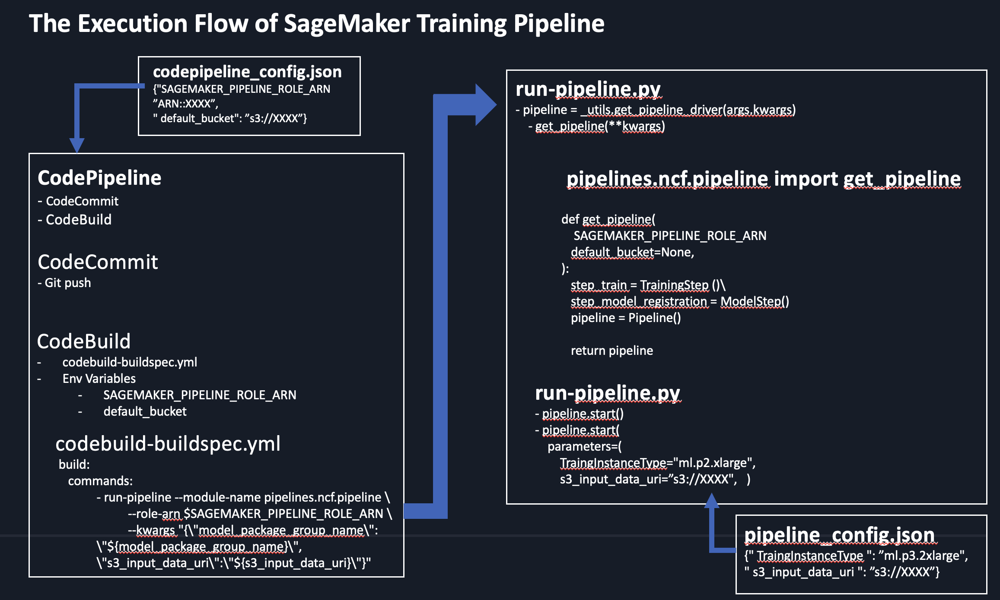

# Lab4: 4_sm-train-codepipeline
- 모델 훈련을 위해서 code pipeline 을 SageMaker pipeline 과 연결.

# 1. 실습 파일 

- 1.0.Create_Config.ipynb
    - Config.json 을 생성하는 노트북
- 1.1.create_codecommit.ipynb
    - 코드 리파지토리 생성 및 코드 복사
- 2.1.build_project.ipynb
    - 빌드 프로젝트 생성
- 3.1.pipeline_project.ipynb
    - 코드 파이프라인 생성
- 4.1.Cleanup.ipynb
    - 클린업 

# 2. 업무 적용시 작업 순서
- 이 모듈의 전체적인 생성 가이드 입니다.
    - [SageMaker 훈련 파이프라인 생성 가이드](0.0.create-pipeline.py-buildspec.yml.ipynb)
    - 
