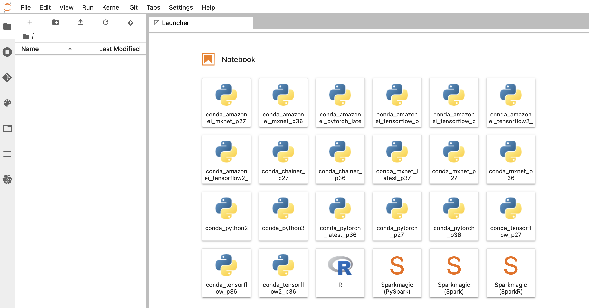

Amazon SageMaker Notebook 생성 및 권한 설정
====================================================

Amazon SageMaker 실습에 오신 것을 환영합니다!

실습에 이용할 Amazon SageMaker 노트북 인스턴스는 Jupyter 노트북 앱을 실행하는 기계 학습(ML) 컴퓨팅 인스턴스입니다. SageMaker는 인스턴스와 관련 리소스 생성을 관리합니다. 노트북 인스턴스에서 Jupyter 노트북을 사용하여 데이터를 준비, 처리하고, 코드를 작성하여 모델을 학습하고, SageMaker 호스팅에 배포하고, 모델을 테스트하거나 검증할 수 있습니다.

이 실습에서는 본격적인 기계학습 실습 전에 AWS CloudFormation을 사용하여 기계학습 실습에 필요한 Amazon SageMaker 노트북 인스턴스 생성 및 관련 권한 설정을 합니다. 자 시작합니다!

### Requirements:

* AWS account - 계정이 없다면 무료로 쉽게 계정을 [생성](https://aws.amazon.com/)할 수 있습니다.
* 권한을 가진 AWS IAM 계정을 통해 CloudFormation, Lambda와 상호 작용할 수 있습니다. [Learn how](https://docs.aws.amazon.com/IAM/latest/UserGuide/id_users_create.html).


### IMPORTANT: Workshop Cleanup

AWS에 인프라 배포는 비용이 발생됩니다. AWS 이벤트에 참석하는 경우 크레딧이 제공됩니다. 워크샵을 마쳤으면 [지침의 마지막 부분에 있는 단계](#workshop-cleanup)를 통해 모든 것이 삭제되었는지 확인하여 불필요한 과금이 발생되지 않도록 합니다.
## --> 추후에 클린업 내용 수정

## Let's Begin!

### Workshop Setup:

1. 브라우저의 새 탭에서 아래의 CloudFormation 시작 템플릿 링크를 엽니다. 링크는 CloudFormation 대시 보드를 로드하고 선택한 리전에서 스택 생성 절차를 시작합니다:
- 아래 CloudFormation 은 ml.p3.2xlarge 의 SageMaker Notebook Instance를 설치 합니다.
    - 참고로 이 워크샵은 ml.g4dn.xlarge, ml.p3.2xlarge, ml.p3.8xlarge, ml.p3.16xlarge "세이지 메이커 노트북 인스턴스"의 conda_python3에서 테스트 되었습니다.
   
    
아래의 원하시는 리전의 **Deploy to AWS** 아이콘을 클릭하여 워크숍 인프라를 생성합니다.

| Region | Launch Template |
| ------------ | ------------- | 
**Seoul** (ap-northeast-2) | [](https://console.aws.amazon.com/cloudformation/home?region=ap-northeast-2#/stacks/new?stackName=sagemaker-notebook&templateURL=https://ee-assets-prod-us-east-1.s3.us-east-1.amazonaws.com/modules/c16b965656fb4eba8676d6f0ac759300/v1/ncf/MLOps-CF.yaml)  
**Virginia** (us-east-1) | [](https://console.aws.amazon.com/cloudformation/home?region=us-east-1#/stacks/new?stackName=sagemaker-notebook&templateURL=https://ee-assets-prod-us-east-1.s3.us-east-1.amazonaws.com/modules/c16b965656fb4eba8676d6f0ac759300/v1/ncf/MLOps-CF.yaml)  


1. 템플릿을 통해 자동으로 CloudFormation 대시 보드로 이동하여 지정된 리전에서 스택 생성 프로세스를 시작합니다. 사전에 S3에 업로드된 템플릿이 지정되어있으므로 "다음" 버튼을 클릭하고 스택에 관한 정보를 입력하게 되는데 스택을 계정 내에서 고유한 스택 이름을 지정하고(여기서는 sagemaker-notebook 자동 지정) Notebook Instance Name에는 원하는 이름을 입력하면 마법사를 통해 스택을 시작합니다. 모든 옵션을 기본값으로 유지하지만 CloudFormation에서 사용자를 대신하여 IAM 역할을 생성할 수 있도록 아래와 같이 확인란을 선택해야합니다:

    

    스택 실행 진행 상황은 *이벤트* 탭을 참고하십시오. 시작이 실패하면 문제에 대한 세부 정보를 볼 수도 있습니다. 스택 상태가 "CREATE_COMPLETE"로 진행되면 다음 이제 워크샵을 진행합니다.

2. CloudFormation으로 생성된 SageMaker Notebook에 접속:

    AWS 콘솔 홈페이지에서 서비스 검색바에 **SageMaker**를 입력하고 선택합니다. "Project-***STACK_NAME***"과 같은 환경을 찾습니다:

    

    노트북 인스턴스의 작업란에서 Jupyter나 JupyterLab을 열면 다음과 같은 시작 화면이 나타납니다:
    

    노트북의 우측 Launcher에는 사용할 수 있는 노트북과 콘솔 등이 나타납니다. 가장 아래에 위치한 Terminal을 선택해서 터미널을 실행합니다.
    
3. github에서 저장소 복제:

    명령줄을 위한 터미널이 열리고 사용할 준비가 되었습니다. 터미널에서 다음 git 명령을 실행하여 이 워크샵을 완료하는데 필요한 코드를 복제합니다:

    ```
    $ cd SageMaker
    $ git clone https://github.com/gonsoomoon-ml/Neural-Collaborative-Filtering-On-SageMaker
    ```

    저장소를 복제하면 좌측의 탐색기에 복제된 파일이 포함된 것을 볼 수 있습니다.

### Checkpoint:
축하합니다. 이제 본격적인 워크샵을 진행할 수 있는 환경이 만들어졌습니다. 모든 워크샵이 끝난 후에 **Workshop Cleanup**에서 워크숍 중에 생성된 모든 자산이 제거되도록 아래 단계를 수행하여 오늘 이후에 예기치 않은 비용이 발생하지 않도록 합니다.
#### --> 위의 내용 추후 수정

### IMPORTANT: Workshop Cleanup

AWS에 인프라 배포는 비용이 발생됩니다. AWS 이벤트에 참석하는 경우 크레딧이 제공됩니다. 워크샵을 마쳤으면 [지침의 마지막 부분에 있는 단계](#workshop-cleanup)를 통해 모든 것이 삭제되었는지 확인하여 불필요한 과금이 발생되지 않도록 합니다.

## Workshop Cleanup

계정에 무언가를 두면 요금이 계속 발생하기 때문에 이는 매우 중요합니다. 어떤 것들은 CloudFormation에서 생성하고 어떤 것들은 워크샵을 통해 수동으로 생성했습니다. 아래 단계에 따라 올바르게 삭제합니다.

랩 전체에서 수동으로 생성된 리소스를 삭제합니다:

* S3 - 먼저 S3 버킷 중 sagemaker-ap-northeast-2-*로 시작하는 이름의 버킷을 삭제합니다.

마지막으로, CloudFormation의 상단 삭제 버튼을 클릭해서 워크숍에서 사용된 [CloudFormation 스택을 삭제합니다](http://docs.aws.amazon.com/AWSCloudFormation/latest/UserGuide/cfn-console-delete-stack.html). 

스택 삭제 프로세스에 오류가 발생하면 CloudFormation 대시 보드에서 이벤트 탭을 보고 실패한 단계를 확인합니다. CloudFormation에서 관리하는 리소스에 연결된 수동으로 생성된 리소스를 정리해야하는 경우 일 수 있습니다.

## [Option] SageMaker Studio 시작하기

### --> 추후에 Studio 생성 링크 추가
